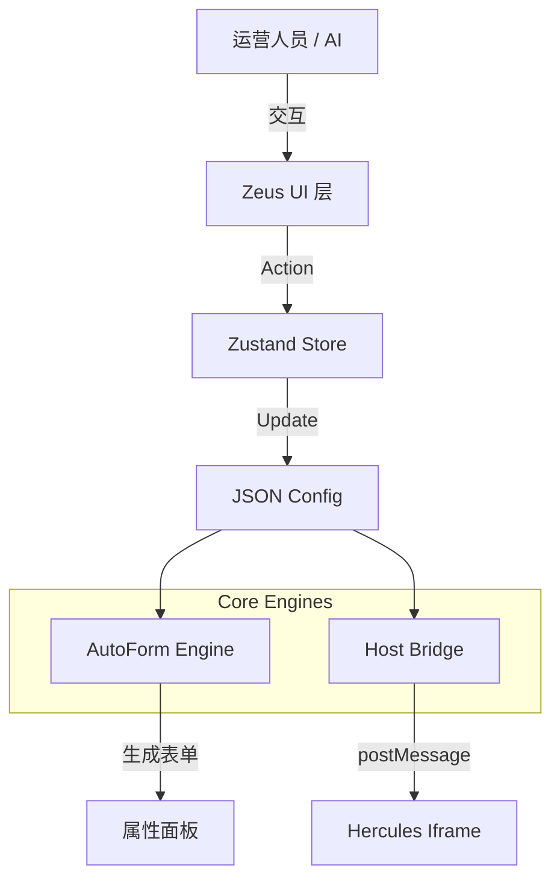

# Zeus 编辑器架构指南 (Architecture Guide)

Zeus 是 Genesis 平台的所见即所得 (WYSIWYG) 编辑器。它是一个纯客户端的 Next.js 应用（尽管使用了 Next.js 框架，但主要逻辑运行在浏览器端），负责为运营人员和 AI Agent 提供构建页面的交互界面。

---

## 核心架构概览

Zeus 的架构设计围绕着 **"数据驱动 (Data-Driven)"** 和 **"宿主分离 (Host Separation)"** 两个核心原则。

---

## 1. 自动表单引擎 (AutoForm Engine)

这是 Zeus 最具魔力的部分。它负责将静态的 Schema 定义转化为动态的 UI 交互界面。

### 原理
AutoForm 采用递归渲染策略。它遍历 Zod Schema 的结构，根据节点类型决定渲染哪个 React 组件。同时，它会解析 Schema 描述中的**元数据 (Metadata)** 来提供更丰富的交互体验。

*   **Metadata Parsing**: 自动解析 `.describe()` 字符串中的特殊标记：
    *   `@labels({"key":"value"})`: 为 Enum 提供中文显示名称。
    *   `@unit(px)`: 为数值输入框添加自动单位处理（显示时去除单位，保存时追加单位）。
    *   `@default(value)`: 为 Discriminated Union 指定默认选中的类型。
*   **ZodString**:
    *   默认渲染为 `<Input type="text" />`。
    *   若检测到 `@unit` 元数据，渲染为带单位后缀的数字输入框。
*   **ZodBoolean** -> `<Switch />`
*   **ZodEnum**:
    *   渲染为 `<Select />`。
    *   优先使用 `@labels` 定义的中文名称作为选项显示，原始值作为实际值。
*   **ZodNumber** -> `<Input type="number" />`
*   **ZodObject** -> `
...递归渲染子节点...
`
*   **ZodArray** -> 渲染为一个可排序的列表，每个列表项包含删除按钮和递归渲染的子表单。
*   **ZodDiscriminatedUnion**:
    *   渲染为带类型选择器的嵌套表单。
    *   支持多级嵌套（Nested Unions）。
    *   支持通过 `@default` 指定默认选中项。

### 优势
*   **零样板代码 (Zero Boilerplate)**: 新增组件无需修改编辑器代码。
*   **类型安全**: 表单生成的数据严格符合 Schema 定义。

---

## 2. 宿主桥接 (Host Bridge)

由于渲染引擎 (Hercules) 和编辑器 (Zeus) 是两个独立的应用，我们通过 `iframe` 将 Hercules 嵌入到 Zeus 中，并使用 `postMessage` 进行双向通信。

### 通信协议

#### Zeus -> Hercules (Downlink)
*   **`SYNC_CONFIG`**: 当用户修改配置时，Zeus 将完整的 JSON 树发送给 Hercules 进行重绘。
*   **`SYNC_SELECTION`**: 当用户在图层树中选中某楼层时，通知 Hercules 高亮对应组件。
*   **`SCROLL_TO_VIEW`**: 通知 Hercules 滚动到指定视图位置。

#### Hercules -> Zeus (Uplink)
*   **`READY`**: Hercules 加载完毕，通知 Zeus 可以发送初始数据。
*   **`SELECT_NODE`**: 用户直接点击 Iframe 中的组件时，通知 Zeus 更新选中状态和属性面板。

---

## 3. 状态管理 (State Management)

我们使用 `Zustand` 来管理编辑器的复杂状态，核心分为两部分配置：

### Current Config vs Draft Config
为了实现流畅的编辑体验（特别是对于复杂的表单输入），我们采用了 **乐观更新 (Optimistic UI)** 和 **草稿模式 (Draft Mode)**。

*   **Current Config**: 当前确定的、已提交的页面配置。
*   **Draft Config**: 用户正在编辑、尚未完全确认的临时配置（例如正在拖动滑块、正在输入文字）。

### 数据流
1.  **用户操作**: 用户在属性面板输入。
2.  **更新 Draft**: `useEditorStore` 更新 `draftConfig`。
3.  **实时预览**: Iframe 接收到 `draftConfig` 并渲染预览。
4.  **提交**: 用户输入完成（如 input blur），Draft 被合并入 Current Config。

---

## 4. 拖拽编排 (Drag & Drop)

图层树 (`FloorTree`) 使用 `@dnd-kit/core` 实现。

*   **Sortable**: 每个楼层节点都是一个可排序项。
*   **Strategy**: 使用 `verticalListSortingStrategy` 处理垂直列表排序。
*   **Event**: 监听 `onDragEnd` 事件，计算新的索引位置，并在 Store 中通过 `array.splice` 移动楼层数据。

